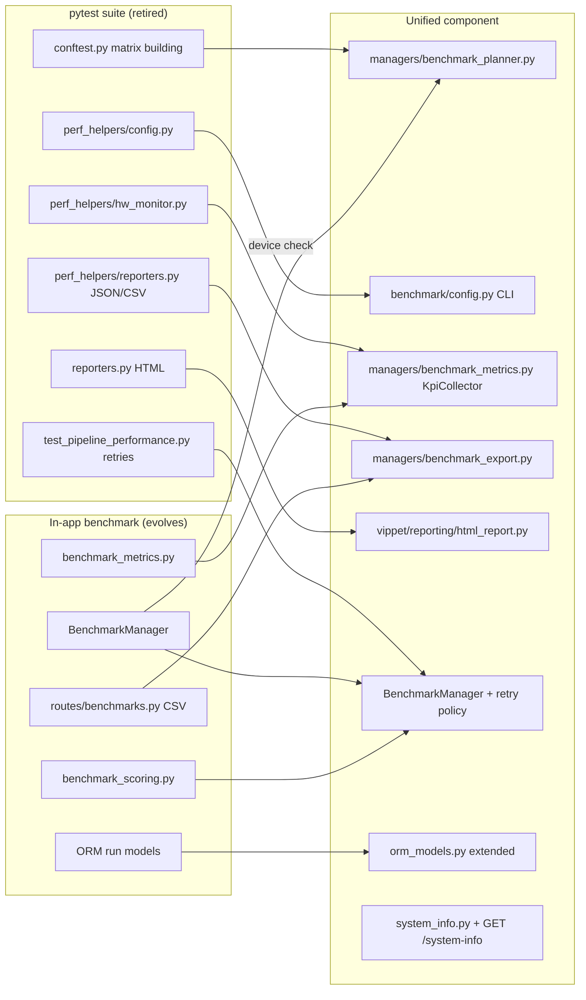

# ViPPET Benchmark Suite Unification — Architecture Overview & Plan

## 1. Problem statement

ViPPET currently has **two independent benchmarking implementations** that overlap heavily and
diverge in features. Neither alone satisfies the customer requirement; maintaining both doubles the
cost of every fix.

| Capability | In-app benchmark (UI) | pytest perf suite |
|---|:---:|:---:|
| Location | `managers/benchmark_manager.py`, `/benchmarks` API, `ui/src/features/benchmarks` | `vippet/tests/performance/` |
| Pipeline/variant/stream selection | Fixed YAML suites (Retail, Metro, Manufacturing) seeded to DB | Dynamic: config filters + live discovery |
| Customer pipelines | ✗ (suite YAML only, requires rebuild) | ✗ (filter by id only) |
| Hardware compatibility check | ✓ (skip if device missing) | ✓ |
| Missing-model validation | ✗ | ✓ (flag read but not honoured) |
| Retries | ✗ | ✓ (not persisted) |
| Runtime per case | Hard-coded 30 s | Configurable |
| KPI collection | In-process, Telegraf text, trimmed mean | Background SSE sampler, avg/min/max |
| Scoring (perf/efficiency/total) | ✓ | ✗ |
| Persistence | SQLite (run history in UI) | Files only |
| JSON export | ✗ | ✓ |
| CSV export | ✓ (endpoint) | ✓ |
| HTML report | ✗ | ✓ (Chart.js) |
| System info | ✗ | Partial (devices only) |
| Dry-run / report-only | ✗ | collect-only / ✗ |
| Pre-flight readiness | n/a (in-process) | ✗ |
| Headless / CI entry point | REST only | `make test-performance` |
| Exit codes | n/a | pytest's |

## 2. Target architecture (summary)

**One Benchmark Engine, two thin clients.**

- The **Benchmark Engine lives in the `vippet` backend** and becomes the single execution path.
  It generalises today's `BenchmarkManager` from "run a seeded suite" to "run a *RunSpec*"
  (pipelines × variants × streams + filters + customer pipelines + execution policy).
  Built-in suites become pre-defined RunSpecs; ad-hoc runs are persisted alongside them so the UI
  shows CLI-initiated runs and vice versa.
- **`vippet-bench` CLI** (new, `benchmark/` folder) replaces the pytest suite. It owns only
  operator concerns: YAML/CLI config, pre-flight, dry-run display, polling, saving exports to a
  timestamped directory, `latest` symlink, exit codes.
- **HTML report renderer** is a standard-library-only module `vippet/reporting/html_report.py`
  used by both the backend endpoint and the CLI's offline `--report-only` mode.
- **UI** keeps the existing Benchmarks feature and gains a "Custom run" wizard plus export buttons
  (optional; not required by the customer AC but completes the merge).

See [c4-benchmark.md](c4-benchmark.md) for Context, Container, Component, Dynamic and Deployment
diagrams.

### What moves where

## 3. Key design decisions (for review)

| # | Decision | Rationale | Alternatives considered |
|---|---|---|---|
| D1 | **Execution engine in backend, not in CLI** | Single source of truth; UI and CLI produce identical results; KPI collection already in-process; persisted history | Standalone CLI runner (previous plan) — duplicates matrix/retry/KPI logic with the UI path |
| D2 | **Ad-hoc runs persisted as `BenchmarkSuite(kind=adhoc)` + `BenchmarkSuiteRun.run_spec_json`** | Reuses existing run/workload/test-case ORM and UI tables with minimal schema change | Separate tables for ad-hoc runs — more code, two UI views |
| D3 | **`POST /benchmarks/plan` as the dry-run contract** | Dry-run output equals what will execute (same planner); CLI stays thin | CLI-side planning — reintroduces duplication |
| D4 | **HTML renderer as stdlib-only shared module** | `--report-only` works offline; one template for server and CLI | (a) HTML only via backend — report-only needs a running server; (b) CLI-only HTML — UI cannot download reports |
| D5 | **KPI sampling via Metrics Manager pull in backend (`KpiCollector`)** | Already how in-app suite works; avoids SSE client in CLI; scoped to job window per attempt | Keep `hw_monitor.py` in CLI — KPIs would differ between UI and CLI runs |
| D6 | **Retry policy inside `BenchmarkManager`** | Attempts and `retries_exhausted` persisted and visible in UI/exports (AC 7) | CLI-side retries — invisible to UI history, double job ids |
| D7 | **pytest suite retired; replaced by a functional smoke test that invokes the CLI** | Removes the second implementation; keeps CI coverage of the end-to-end path | Keep both with shims — ongoing drift |
| D8 | **`GET /system-info` served by backend** | Host metadata is closest to the hardware; CLI may run remotely | CLI-local `platform`/`psutil` — wrong host when remote |
| D9 | **Built-in suites reinterpreted as named RunSpecs** (`vippet/benchmarks/*.yaml` gains `execution`/`filters` keys) | One planner handles both; suites become configurable (runtime, retries) | Keep suite path separate — two execution branches |

## 4. Scope

**In scope**
- Backend: planner, RunSpec API, retries/timeouts, skip reasons, KPI avg/min/max, exports (JSON/CSV/HTML), system-info, schema migration (`db_schema_version` bump).
- CLI: `benchmark/` package, presets, Makefile targets, docs.
- Shared HTML renderer.
- Retire `vippet/tests/performance/` in favour of a CLI smoke test.
- Documentation (user guide, release notes) and C4 updates.

**Out of scope (this iteration)**
- Density tests in benchmark runs.
- Distributed/multi-host benchmarking.
- Changing scoring formulas.
- Helm/Compose changes (CLI runs from the repo venv or a CI runner).

**Optional**
- UI: Custom-run wizard, skipped-reason/attempts columns, JSON/HTML download.

