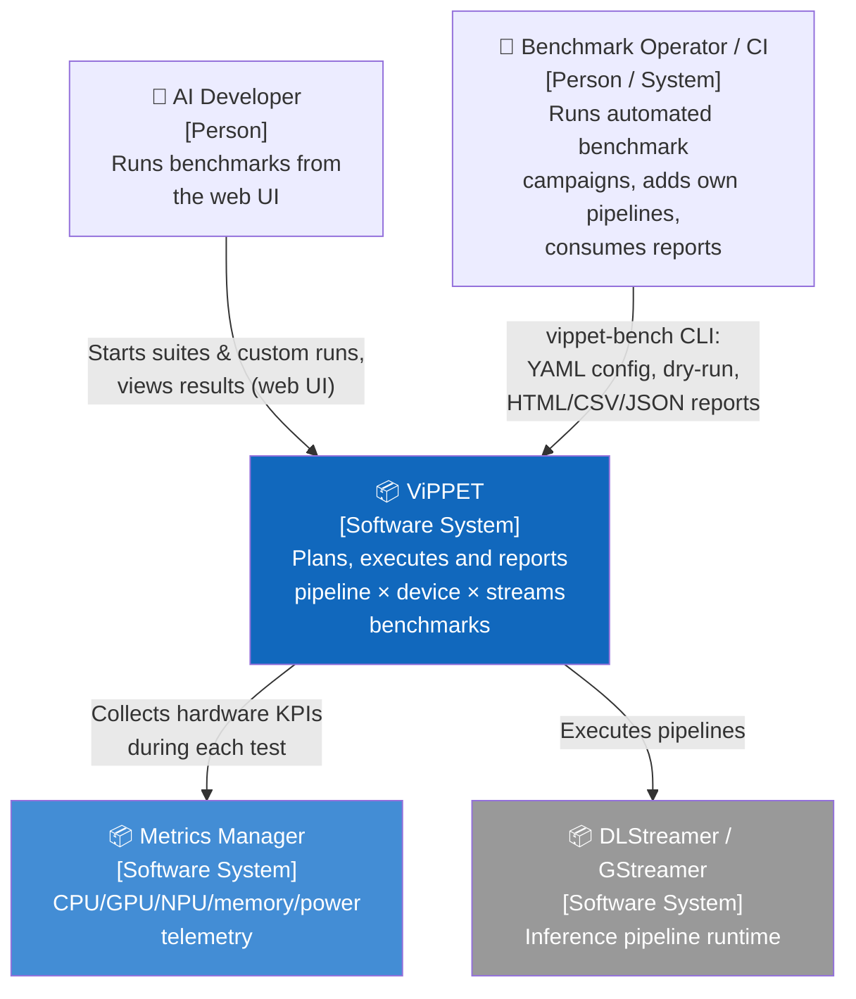
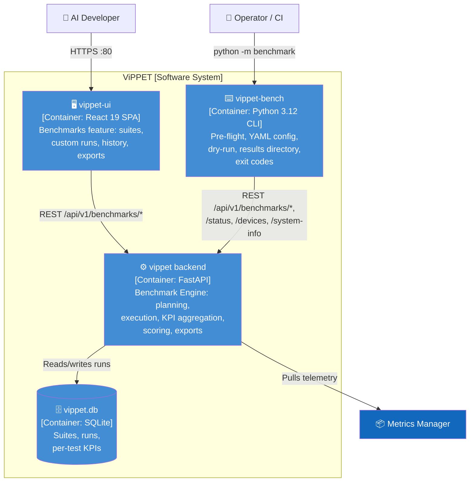
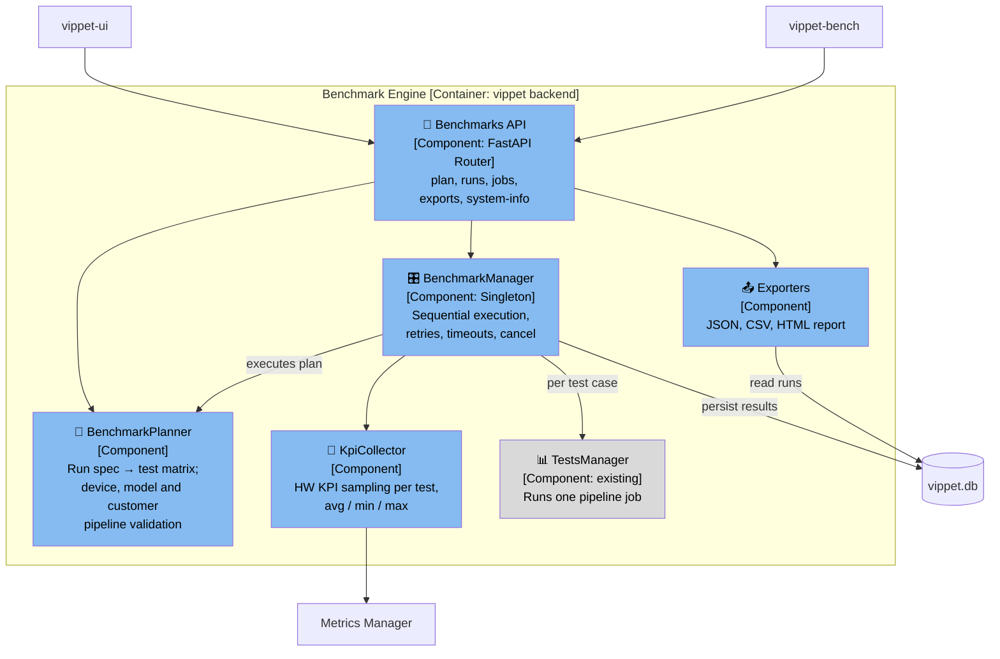
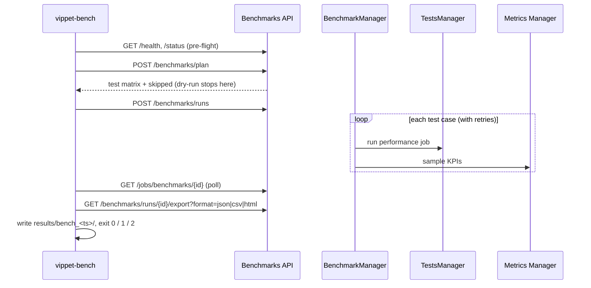

# C4 Model — ViPPET Benchmark Suite

> Date: 2026-09-16
> Component: `tools/visual-pipeline-and-platform-evaluation-tool` — Benchmark Suite

The Benchmark Suite merges the former in-app benchmark (`BenchmarkManager`, `/benchmarks` API, UI)
and the pytest performance suite (`vippet/tests/performance/`) into one component: a **Benchmark
Engine** in the backend, used by the web UI and by a new **`vippet-bench` CLI**.

---

## Level 1: System Context

---

## Level 2: Container Diagram

### Container Descriptions

| Container | Technology | Responsibility |
|-----------|-----------|----------------|
| **vippet backend** | Python 3.12, FastAPI, SQLAlchemy | Single execution path for all benchmark runs: builds test matrix, validates hardware/models, runs cases with retries, collects KPIs, persists, exports JSON/CSV/HTML |
| **vippet-bench** | Python 3.12, httpx, PyYAML | Headless client: config → run spec, pre-flight checks, dry-run, polls progress, saves reports to `results/bench_<ts>/`, returns exit code |
| **vippet-ui** | React 19, RTK Query | Existing Benchmarks feature; starts runs and shows history via the same API |
| **vippet.db** | SQLite | Run history shared by UI and CLI |

---

## Level 3: Component Diagram — Benchmark Engine (vippet backend)

### Component Descriptions

| Component | File(s) | Responsibility |
|-----------|---------|----------------|
| **Benchmarks API** | `api/routes/benchmarks.py`, `api/routes/jobs.py`, `api/routes/system.py` | `POST /benchmarks/plan` (dry-run), `POST /benchmarks/runs`, job status, `GET …/export?format=json\|csv\|html`, `GET /system-info` |
| **BenchmarkPlanner** | `managers/benchmark_planner.py` | Builds pipeline × variant × streams matrix from a run spec; skips variants without matching hardware or with missing models; resolves customer pipelines by id/name |
| **BenchmarkManager** | `managers/benchmark_manager.py` | Runs the plan sequentially; retry policy, per-job timeout, cancellation; records attempts and errors |
| **KpiCollector** | `managers/benchmark_metrics.py` | Samples Metrics Manager during each test window; aggregates CPU/GPU/NPU/memory/power KPIs |
| **Exporters** | `managers/benchmark_export.py`, `reporting/html_report.py` | Run → JSON / CSV / HTML (HTML renderer is stdlib-only so the CLI can regenerate reports offline) |
| **TestsManager** | `managers/tests_manager.py` | Existing; executes a single performance job via `PipelineRunner` |

---

## Key Data Flow — Automated run

